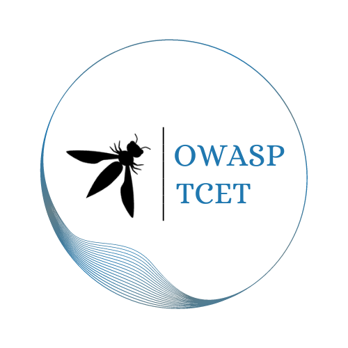

---

layout: col-sidebar
title: OWASP TCET (Thakur College of Engineering and Technology)
tags: OWASP TCET
region: Asia
meetup-group:

---



## Welcome
Welcome to the official page of Thakur College of Engineering and Technology's student chapter of OWASP! This chapter was established in July 2023 by a group of students enthusiastic about exploring and sharing the knowledge of cybersecurity. We aim to familiarize everyone with the necessary information to protect themselves in this perpetual digital world.  No matter what background you belong to, a desire to learn is all you need to join us and become an integral part of this fruitful mission.

## Participation
All events that will be conducted under OWASP TCET are open to everyone and anyone. Join us for a fun-filled and thought-provoking time wherein you will learn essential skills in Cybersecurity. By participating, you will get the opportunity to contribute your unique skills, insights, and ideas which will not only enrich your personal growth but also provide a chance to connect with fellow students who share similar passions and interests. Whether you have prior experience or are eager to explore new avenues, your enthusiasm and willingness to contribute are what truly matter.

## Next Meeting/Event <!-- You should keep this section as it will populate your meetup events -->
---------------------
