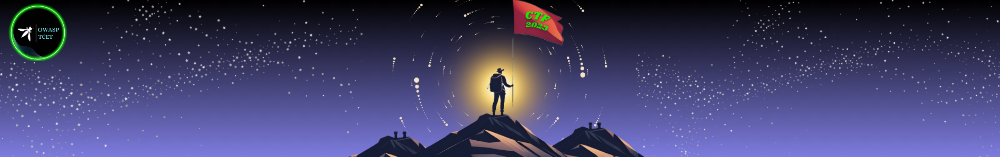

## Our Roles

| Role | Name |
| --- | --- | --- |
| Event Manager | [Sharez Shaikh](mailto:sharez.shaikh@owasp.org) | 
| Outreach Manager | [Harshit Pandey](mailto:harshitvpandey@gmail.com) |
| Secretary | [Rhea Rajput](mailto:rhea.rajput@owasp.org) |
| Technical Head | [Shivam Mishra](mailto:shivam.mishra@owasp.org) |
| Treasurer | [Kaushal Agarwal](mailto:kaushalagarwal1818@gmail.com) |
| Webmaster | [Vaibhav Singh](mailto:vaibhav.singh@owasp.org) |
| Creative Lead | [Saumya Maheshwari](mailto:saumyamurkya@gmail.com) |
| Event Coordinator | [Dhiraj Kalwar](mailto:dhirajkalwar57@gmail.com) |
| Junior Secretary | [Lakshya Singh](mailto:beyondlakshya@gmail.com) |
| Outreach Coordinator | [Sharad Pandey](mailto:pandeysharad079@gmail.com) |
| Web Lead | [Soorya Srihari](mailto:abhinavsurya211@gmail.com) |

## Gallery

    

        
        
Date: January 1, 2023

    

    

        
        
Date: February 15, 2023

    

    <!-- Add more gallery items as needed -->

